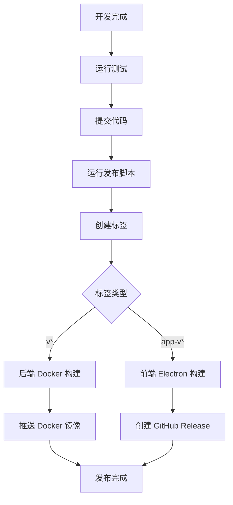
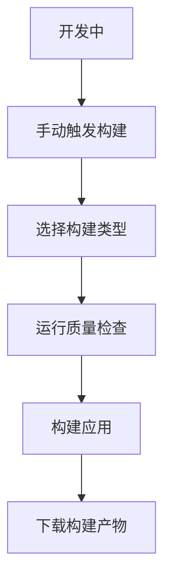

# GitHub Actions Node.js 14 配置总结

本文档总结了将项目的 GitHub Actions 配置更新为使用 Node.js 14 并调整触发条件的所有更改。

## ✅ 完成的更改

### 1. Node.js 版本统一

**所有 GitHub Actions workflows 现在使用 Node.js 14**:

| Workflow | 文件 | Node.js 版本 | 状态 |
|----------|------|--------------|------|
| Electron Build | `electron-build.yml` | 14 | ✅ 已更新 |
| Docker Backend | `docker-backend.yml` | 14 | ✅ 已更新 |
| Manual Build | `manual-build.yml` | 14 | ✅ 已创建 |

### 2. 触发条件优化

#### 之前的触发策略：
- 推送到 `main` 和 `develop` 分支时构建
- Pull Request 时构建
- 创建标签时构建

#### 现在的触发策略：
- **仅在创建版本标签时构建**，避免不必要的构建

| Workflow | 触发条件 | 构建内容 |
|----------|----------|----------|
| `electron-build.yml` | 创建 `app-v*` 标签 | Electron 桌面应用 |
| `docker-backend.yml` | 创建 `v*` 标签 | Docker 后端镜像 |
| `manual-build.yml` | 手动触发 | 开发测试构建 |

### 3. 文件清理

- ❌ **删除**: `auto-deploy.yml`（与 `docker-backend.yml` 重复）
- ✅ **简化**: 移除不必要的 jobs（update-check、deploy-test）
- ✅ **新增**: `manual-build.yml`（开发专用）

### 4. 发布脚本更新

更新了 `scripts/release.js`：
- 标签策略与 GitHub Actions 对齐
- 创建 `v{version}` 触发后端构建
- 创建 `app-v{version}` 触发前端构建
- 移除了多余的 `api-v*` 标签

## 🏷️ 新的标签策略

### 后端 API 发布
```bash
# 创建后端版本标签
git tag v1.0.0
git push origin v1.0.0
```
**触发**: Docker 镜像构建和推送到 GitHub Container Registry

### 前端应用发布
```bash
# 创建前端版本标签  
git tag app-v1.0.0
git push origin app-v1.0.0
```
**触发**: Electron 应用多平台构建和 GitHub Release

### 使用发布脚本（推荐）
```bash
# 自动创建两个标签并推送
node scripts/release.js patch    # 补丁版本
node scripts/release.js minor    # 次要版本  
node scripts/release.js major    # 主要版本

# 干运行测试
node scripts/release.js patch --dry-run
```

## 🔄 工作流程

### 完整发布流程


### 开发测试流程


## 📋 验证清单

- [x] **Electron Build**: 只在 `app-v*` 标签时触发，使用 Node.js 14
- [x] **Docker Build**: 只在 `v*` 标签时触发，使用 Node.js 14
- [x] **Manual Build**: 支持手动触发，使用 Node.js 14
- [x] **Version Check**: 所有构建都会检查 Node.js 版本兼容性
- [x] **Release Script**: 支持新的标签策略
- [x] **Documentation**: 更新了相关文档

## 🎯 优势

### 1. 资源优化
- **节省构建时间**: 不再在每次推送时构建
- **降低成本**: 减少 GitHub Actions 使用时间
- **减少通知**: 避免不必要的构建通知

### 2. 版本控制
- **明确发布**: 只有明确的版本标签才会触发构建
- **标签规范**: 清晰的标签命名规范
- **自动化**: 发布脚本自动化整个流程

### 3. 兼容性保证
- **Node.js 14**: 确保所有构建使用正确版本
- **版本检查**: 自动验证环境兼容性
- **错误预防**: 避免版本不匹配导致的构建失败

## 🚀 使用示例

### 发布新的补丁版本
```bash
# 1. 确保代码已提交
git add .
git commit -m "fix: 修复重要问题"

# 2. 运行发布脚本
node scripts/release.js patch

# 3. 脚本会自动：
#    - 更新版本号
#    - 创建提交
#    - 创建标签 v1.0.1 和 app-v1.0.1  
#    - 推送到远程

# 4. GitHub Actions 会自动构建：
#    - Docker 镜像 (ghcr.io/.../subscription-manager-api:1.0.1)
#    - Electron 应用 (Windows、macOS、Linux)
```

### 开发测试构建
```bash
# 1. 访问 GitHub Actions 页面
# 2. 选择 "Manual Development Build"
# 3. 点击 "Run workflow"
# 4. 选择构建类型和选项
# 5. 运行构建并下载产物
```

## 📊 构建监控

### GitHub Actions 页面
- **Electron Build**: `https://github.com/用户名/仓库名/actions/workflows/electron-build.yml`
- **Docker Build**: `https://github.com/用户名/仓库名/actions/workflows/docker-backend.yml`
- **Manual Build**: `https://github.com/用户名/仓库名/actions/workflows/manual-build.yml`

### 构建产物
- **Docker 镜像**: GitHub Container Registry
- **Electron 应用**: GitHub Releases
- **开发构建**: Actions Artifacts（3天保留期）

这样配置后，项目的 CI/CD 流程更加高效、可控，并且确保了 Node.js 版本的一致性。
